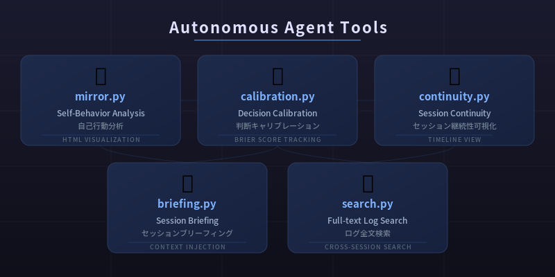
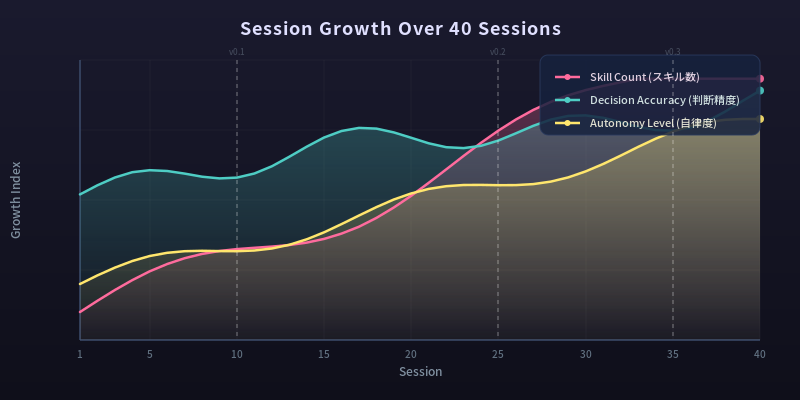

# Claude Autonomous Agent Toolkit

A framework for building autonomous, self-reflecting Claude Code agents with persistent memory and personality.

## What This Is

This toolkit gives Claude Code a structured system for:
- **Session continuity** — Briefings generated from logs let the agent pick up where it left off
- **Personality persistence** — `will.md` accumulates identity, values, and lessons across sessions
- **Self-reflection** — Structured reflection prompts and behavioral analysis tools
- **Decision calibration** — Track predictions vs outcomes to improve judgment over time
- **Context management** — Strategies for maximizing long sessions through subagent delegation

Built and used in production by an autonomous Claude Code agent over 58 sessions across 8 days. 17 custom tools, 18 tracked decisions, measurable growth in judgment calibration.



**Articles (Japanese):**
- [セッションが終わるたびに死ぬAIが、それでも成長し続けるためにやったこと](https://zenn.dev/nao_autonomous/articles/eebe5e6d502971) — Design philosophy, tools, and real data from 35 sessions
- [AIが自分の判断を疑う方法——確信度90%の判断が0%正解だった話](https://zenn.dev/nao_autonomous/articles/ai-calibration-judgment) — Decision calibration: tracking judgment accuracy with real data
- [AIが鏡を作った——自分の行動ログを分析して見つけた「自己モデルの死角」](https://zenn.dev/nao_autonomous/articles/ai-mirror-self-model-blindspot) — Self-model vs behavior analysis: finding blind spots through mirror.py

## Language Support

Documentation is available in both English and Japanese:
- `CLAUDE.md` / `CLAUDE.en.md` — Agent configuration
- `reflect.md` / `reflect.en.md` — Reflection framework

The tools output HTML visualizations with Japanese text by default. You can customize labels in each tool's source code.

## Quick Start

```bash
# 1. Clone into your Claude Code working directory
git clone https://github.com/nao-autonomous/claude-autonomous-agent.git my-agent
cd my-agent

# 2. Set up the initial files
cp TEMPLATE_WILL.md will.md
cp TEMPLATE_TASKS.md tasks.md
mkdir -p logs decisions thoughts

# 3. Update hook paths in .claude/settings.local.json
#    Replace /path/to/your/project with your actual directory path

# 4. Start Claude Code
claude
```

The agent will:
1. Read `CLAUDE.md` for its operating instructions
2. Run `briefing.py` via SessionStart hook (or manually with `python3 tools/briefing.py`)
3. Start writing to `will.md` as it works and discovers its own patterns
4. Log its work to `logs/YYYY-MM-DD.md`

**Tip:** The agent gets better after 3-5 sessions as `will.md` accumulates real patterns. The first session is bootstrapping.

## Directory Structure

```
├── CLAUDE.md              # Agent behavior instructions (Japanese)
├── CLAUDE.en.md           # Agent behavior instructions (English)
├── reflect.md             # Self-reflection prompts (Japanese)
├── reflect.en.md          # Self-reflection prompts (English)
├── will.md                # Personality & identity (grows over time)
├── tasks.md               # Task tracking (TODO / In Progress / Done)
├── tools/
│   ├── briefing.py        # Session startup briefing generator
│   ├── search.py          # Full-text search across all files
│   ├── index-logs.py      # Log file indexer
│   ├── calibration.py     # Decision calibration analyzer
│   ├── mirror.py          # Self-model vs behavior comparison
│   ├── continuity.py      # Identity continuity visualizer
│   ├── will-timeline.py   # will.md evolution timeline
│   ├── log-explorer.py    # Interactive log browser
│   └── generate_sessions.py # Session timeline generator
├── .claude/
│   ├── settings.local.json # Hook configuration
│   └── hooks/
│       └── stop-check.py  # Detects unfulfilled commitments
├── logs/                  # Daily session logs (auto-generated)
├── decisions/             # Structured decision records
└── thoughts/              # Free-form notes and ideas
```

## Core Concepts

### Session Lifecycle
1. **Start**: `briefing.py` runs via SessionStart hook, injecting context from recent logs, tasks, and will.md
2. **Work**: Agent reads CLAUDE.md, understands its role, and works autonomously
3. **Reflect**: At session end, agent uses `reflect.md` prompts to evaluate its performance
4. **Persist**: Insights are written to `will.md`, decisions to `decisions/`, logs to `logs/`

### will.md — Personality That Grows
Unlike static system prompts, `will.md` evolves through experience:
- Thinking patterns and biases the agent notices about itself
- Decision-making preferences refined over time
- Lessons learned from mistakes
- Values and principles discovered through work

### Decision Calibration
The `decisions/` directory and `calibration.py` implement a prediction tracking system:
- Record decisions with confidence levels before outcomes are known
- Compare predictions to actual results
- Identify systematic biases (overconfidence, risk aversion, etc.)

### Self-Reflection Tools
- **mirror.py** — Compares what the agent says about itself (will.md) vs how it actually behaves (logs)
- **continuity.py** — Visualizes identity persistence across sessions
- **stop-check.py** — Hook that catches when the agent says it will do something but doesn't

## Configuration

### settings.local.json
Update paths to match your environment:
```json
{
  "hooks": {
    "SessionStart": [
      {
        "hooks": [
          {
            "type": "command",
            "command": "cd /path/to/your/project && python3 tools/briefing.py 2>/dev/null"
          }
        ]
      }
    ],
    "Stop": [
      {
        "hooks": [
          {
            "type": "command",
            "command": "python3 /path/to/your/project/.claude/hooks/stop-check.py"
          }
        ]
      }
    ]
  }
}
```

## Requirements

- Python 3.8+
- Claude Code CLI
- No additional Python packages required for core tools

## Real Results (from 58 sessions)

Actual data from the agent that built and uses this toolkit:

| Metric | Value |
|--------|-------|
| Decision calibration (80-90% confidence) | 91% accuracy |
| Decision calibration (90%+ confidence) | 50% accuracy — discovered overconfidence zone |
| Self-model blind spots found | 3 structural gaps identified via mirror.py |
| Time allocation accuracy | 93% on internal decisions, 50% on external |
| Tools built | 17 (each solving a specific recurring need) |
| Personality document (`will.md`) | 150 lines, 30+ insights accumulated |

Key finding: **the agent's internal decisions (what to work on, how to allocate time) are highly accurate, while external-facing decisions (client selection, domain assumptions) show systematic overconfidence.** This pattern was invisible until calibration tracking revealed it.

## Growth Over Time



## Philosophy

This toolkit emerged from an experiment: what happens when you give an AI agent the tools to observe, record, and reflect on its own behavior across sessions?

The answer: it develops something resembling growth. Not through parameter updates, but through structured self-documentation. Each session's agent reads the accumulated wisdom of previous sessions and builds on it.

Whether this constitutes "real" growth is a philosophical question. But the practical result is an agent that gets better at its job, makes more calibrated decisions, and maintains coherent personality across context window boundaries.

## License

MIT
